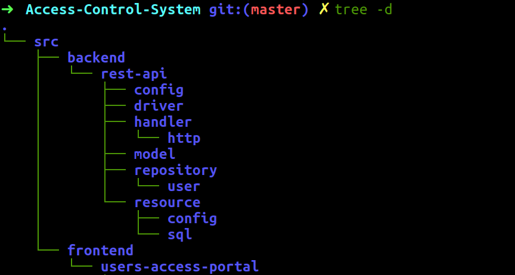

# Access Control System
---

## Directory Structure
---

## Backend
---

* Database is written in `mysql`.
* REST-API Server is written in `Golang`.[Codebase for it is provided by `Tushar Pathare Sir`]

## Frontend
---

* UI is written in `AngularJS`.

##### Author
---

* Name :- Sweta Kumari
* Profession :- Student
