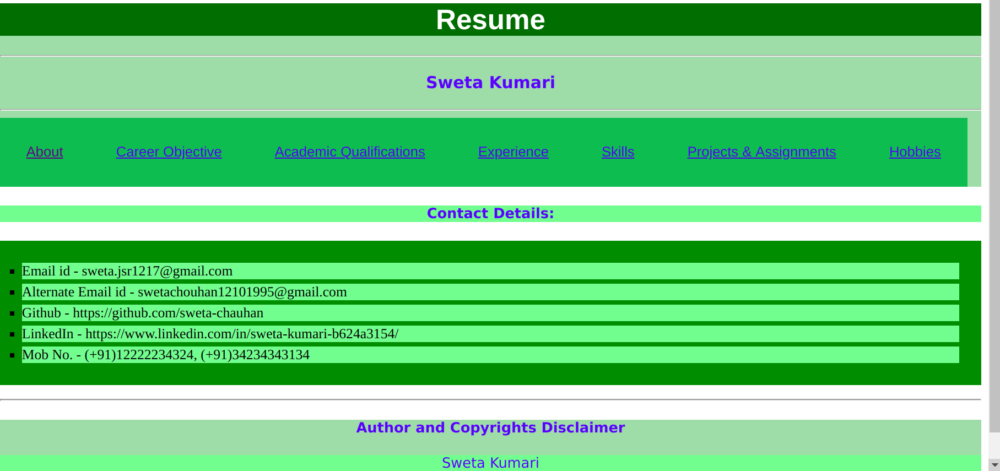

# `Assignment 04`
-----

* This is an angular based website with header and footer.

* In order to run it.

`cd angular_resume`
`ng serve --port <port number>`

* In order to see output.

open browser and type
`localhost:<port number>`

* Output look like as follows.

#### Author
----
* Sweta Kumari
* Student
