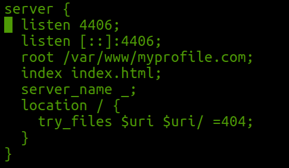

# Assignment-005
---

* This assignment is all about to deploy template based website to `nginx server`.
---

#### How to deploy
---

1.	`cp myprofile.com /var/www/`

2.  `cd /etc/nginx/sites-available` 

3.  Create one server configuration file
	* `vim myprofile`

	* Content of that file is like

4.  Make soft link of myprofile in `/etc/nginx/sites-enables`
	* `ln -s /etc/nginx/sites-available/myprofile /etc/nginx/sites-enabled/myprofile`

5.  Now deployment can be seen sucessfully by..open browser and open
	* `http://[server]:[port]`
	Where server and port is as you specified in step 2

##### Author
----
* Sweta Kumari
* Student
